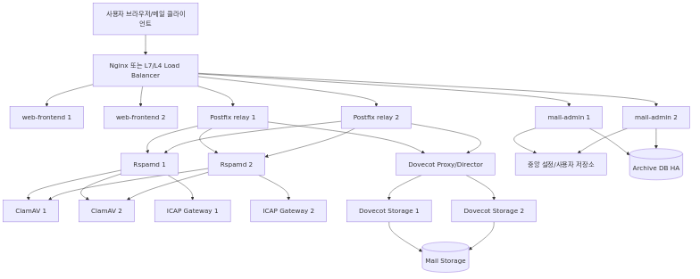

# 대용량 메일 서버 운영 아키텍처 가이드

이 문서는 현재 ucwareMailServer 구조를 기준으로, 대용량 운영 환경으로 확장할 때 어떤 식으로 아키텍처를 바꿔야 하는지 설명합니다.

핵심 결론은 다음과 같습니다.

- Nginx로 `web-frontend`, `mail-admin` 같은 HTTP 계층은 멀티 인스턴스 처리가 가능하다.
- 그러나 Postfix, Dovecot, Rspamd, ClamAV, ICAP, 사용자 저장소/매핑 파일은 별도 확장 전략이 필요하다.
- 즉, "Nginx만 앞에 두면 전체 메일 시스템이 자동으로 수평 확장된다"고 보면 안 된다.

---

## 1) 현재 구조에서 바로 확장하기 어려운 이유

현재 저장소의 기본 구조는 로컬 통합 개발/검증에는 적합하지만, 대규모 수평 확장에는 다음 제약이 있습니다.

### 1.1 `mail-admin`의 로컬 상태 의존

현재 구성에는 아래와 같은 로컬 상태가 존재합니다.

- SQLite 기반 사용자/감사 로그 저장 흐름
- `generated/dovecot/users.passwd`
- `generated/postfix/virtual_mailbox_maps`
- `generated/postfix/virtual_mailbox_domains`
- `data/` 하위 로컬 파일

이 상태로 `mail-admin`을 여러 대 띄우면 다음 문제가 생깁니다.

- 어떤 인스턴스는 최신 사용자 정보를 알고 있음
- 다른 인스턴스는 아직 동기화되지 않음
- 생성된 Postfix/Dovecot 파일이 인스턴스별로 달라질 수 있음
- API는 수평 확장되어도 실제 인증/메일 라우팅 결과가 노드마다 달라질 수 있음

### 1.2 메일 프로토콜 서버의 상태성

HTTP 서비스는 비교적 stateless 하게 만들 수 있지만, 메일 서버는 그렇지 않습니다.

- Postfix는 자체 큐를 가짐
- Dovecot은 사용자 메일 저장소 일관성이 핵심임
- POP3/IMAP은 클라이언트 세션과 메일 상태(읽음/삭제/UIDL 등)에 민감함
- Rspamd/ClamAV/ICAP는 검사 지연이 SMTP 처리 지연으로 전파됨

즉, 메일 시스템은 단순 웹 애플리케이션보다 훨씬 "상태"에 민감합니다.

---

## 2) 권장 목표 아키텍처

대용량 운영 기준 전체 구성도:



원본 Mermaid:

- `docs/diagrams/large-scale-mail-architecture.mmd`

대용량 운영에서는 계층을 분리해서 생각해야 합니다.

### 2.1 HTTP 계층

- L7 Load Balancer 또는 Nginx
- 다중 `web-frontend`
- 다중 `mail-admin`

이 영역은 가장 먼저 수평 확장 가능한 구간입니다.

### 2.2 메일 전송 계층

- 다중 Postfix relay / MX 노드
- DNS MX 다중화 또는 L4 Load Balancer 사용
- 각 노드는 독립 큐를 가질 수 있음

### 2.3 메일 저장/접근 계층

- Dovecot proxy/director 구조 또는 저장소 샤딩
- 공유 스토리지 또는 복제 전략 필요
- Maildir 저장소 일관성 확보 필요

### 2.4 보안 검사 계층

- Rspamd 다중 노드
- ClamAV 풀(pool)
- 외부 ICAP/V3 게이트웨이 다중화

### 2.5 데이터 계층

- 사용자/관리 API 저장소: 중앙 DB 사용
- 아카이브 저장소: PostgreSQL HA 또는 관리형 DB
- 설정/매핑 배포: 중앙 저장소 또는 자동 배포 파이프라인 필요

---

## 3) 단계별 전환 전략

### 3.1 1단계: `mail-admin`를 stateless에 가깝게 만들기

우선 가장 먼저 해야 할 작업입니다.

- SQLite 의존 제거 또는 중앙 DB로 이전
- `generated/` 파일을 로컬 디스크 직접 생성 방식에서 분리
- 설정 생성 결과를 중앙 저장소에 저장하거나, 모든 Postfix/Dovecot 노드에 배포하는 구조 마련

가능한 방식:

1. 중앙 DB에 사용자/도메인/메일박스 상태 저장
2. 배포 에이전트가 Postfix/Dovecot 노드 설정 파일을 재생성
3. 또는 Postfix/Dovecot이 DB/LDAP 기반 조회로 전환

### 3.2 2단계: HTTP 계층 수평 확장

이 단계에서는 Nginx가 실제로 큰 효과를 냅니다.

- `web-frontend` 여러 대 운영
- `mail-admin` 여러 대 운영
- Nginx upstream으로 라운드로빈 또는 least_conn 적용
- JWT 기반 인증이면 세션 고정(sticky)이 꼭 필요하지는 않음

### 3.3 3단계: Postfix 다중 노드화

Postfix는 "relay 노드 여러 대"로 운영하는 방식이 일반적입니다.

- MX 레코드를 여러 개 둘 수 있음
- 또는 L4 VIP 앞단에 여러 SMTP 노드 운영 가능
- 각 노드는 자체 큐를 가짐

주의:

- 큐는 기본적으로 공유되지 않음
- 노드별 로그/지표/반송 추적 체계가 필요함
- 동일 정책/맵 파일이 모든 노드에 일관되게 배포되어야 함

### 3.4 4단계: Dovecot 저장소/프록시 구조 확립

Dovecot은 단순 멀티 인스턴스보다 저장소 전략이 먼저입니다.

선택지는 보통 아래 중 하나입니다.

1. 공유 스토리지 기반
- 구현은 단순하지만 병목/락 문제 가능
- 무작정 NFS에 의존하면 성능 저하 위험

2. 사용자 샤딩 기반
- 특정 사용자/도메인을 특정 Dovecot 백엔드에 고정
- director/proxy 계층이 필요할 수 있음

3. 분산 저장소 기반
- 구현 난이도 높음
- 운영 성숙도가 필요한 구조

### 3.5 5단계: 보안 체인 분리 확장

Rspamd, ClamAV, ICAP는 별도 풀로 확장하는 것이 좋습니다.

- Postfix -> Rspamd milter pool
- Rspamd -> ClamAV pool
- 또는 Rspamd/app -> ICAP gateway pool

이렇게 하면 다음 이점이 있습니다.

- 메일 노드와 보안 엔진을 독립 확장 가능
- 검사 지연 병목을 별도 계층에서 제어 가능
- 장애 원인 분석이 쉬워짐

---

## 4) Nginx로 가능한 것과 불가능한 것

### 4.1 Nginx로 잘 되는 영역

- HTTPS 종료(TLS termination)
- `/` -> `web-frontend` 로드밸런싱
- `/api` 또는 `/v1` -> `mail-admin` 로드밸런싱
- health check 기반 upstream 제외
- rate limiting / request buffering / timeout control

### 4.2 Nginx만으로 해결되지 않는 영역

- Postfix 큐 일관성
- Dovecot 저장소 동기화
- Maildir 상태 관리
- Postfix/Dovecot 설정 파일 배포 일관성
- ClamAV/ICAP 백엔드 병목 해결

즉, Nginx는 "좋은 앞단 로드밸런서"이지, 메일 서버 내부 상태 문제를 해결해 주는 제품은 아닙니다.

---

## 5) 권장 운영 형태 예시

### 5.1 최소 대용량 구조

- Nginx 2대 (active/standby 또는 별도 LB 뒤)
- `web-frontend` 2대 이상
- `mail-admin` 2대 이상
- Postfix 2대 이상
- Dovecot 2대 이상
- Rspamd 2대 이상
- ClamAV 2대 이상
- PostgreSQL HA 또는 관리형 PostgreSQL

### 5.2 더 현실적인 우선순위

1. 중앙 DB화
2. `mail-admin` 멀티 인스턴스
3. Postfix 다중 relay
4. Rspamd/ClamAV 분리 확장
5. Dovecot 저장소 고도화

---

## 6) 이 저장소 기준 Nginx 예시 적용 위치

예시 설정 파일:

- `deploy/nginx/nginx-mail-admin-scale.conf`
- `docker-compose_large.yml`

이 예시는 다음을 보여줍니다.

- 여러 `web-frontend` 인스턴스 upstream
- 여러 `mail-admin` 인스턴스 upstream
- `/` 와 `/v1/` 경로 분리 프록시
- 선택적으로 SMTP/IMAP/POP3를 `stream`으로 분산하는 예시

예시 실행:

```bash
docker compose -f docker-compose_large.yml up -d --build
```

중요:

- 메일 프로토콜에 대한 `stream` 예시는 "가능성 예시"일 뿐입니다.
- 실제 운영에서는 Postfix/Dovecot의 상태/스토리지/큐 구조를 먼저 설계해야 합니다.

---

## 7) 권장 모니터링 지표

### HTTP/API

- Nginx upstream 5xx 비율
- `mail-admin` 응답시간 p95/p99
- 로그인 실패율
- 발송 API 실패율

### SMTP/메일 계층

- Postfix active/deferred queue 길이
- SMTP 세션 수
- 인증 실패율
- 수신/발신 처리량

### 저장/조회 계층

- Dovecot 로그인 성공률
- IMAP/POP3 응답시간
- 메일 저장소 사용량
- LMTP 전달 실패율

### 보안 계층

- Rspamd 검사시간
- ClamAV timeout 비율
- ICAP timeout / fail-open 횟수
- 탐지율과 검사 실패율 분리 추적

---

## 8) 실제 도입 시 꼭 확인할 질문

1. 사용자/도메인 상태를 어디에 중앙 저장할 것인가?
2. Postfix/Dovecot 설정 배포를 어떤 방식으로 일관되게 유지할 것인가?
3. Dovecot 메일 저장소를 공유할 것인가, 샤딩할 것인가?
4. 보안 실패 시 fail-open 인가, fail-close 인가?
5. 장애 시 어떤 계층을 우선 격리하고 우회할 것인가?

---

## 9) 관련 파일

- [docker-compose.yml](docker-compose.yml)
- [POSTFIX_DOVECOT_SYSTEMD_GUIDE_KO.md](POSTFIX_DOVECOT_SYSTEMD_GUIDE_KO.md)
- [MAIL_SERVER_RUN_GUIDE_KO.md](MAIL_SERVER_RUN_GUIDE_KO.md)
- `deploy/nginx/nginx-mail-admin-scale.conf`
- `docs/diagrams/large-scale-mail-architecture.mmd`
- `docs/diagrams/large-scale-mail-architecture.png`
